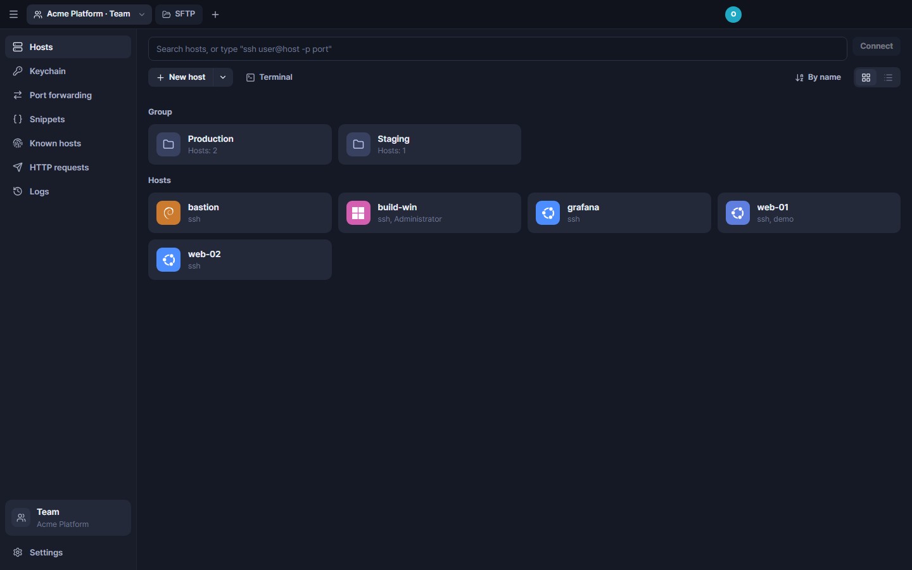
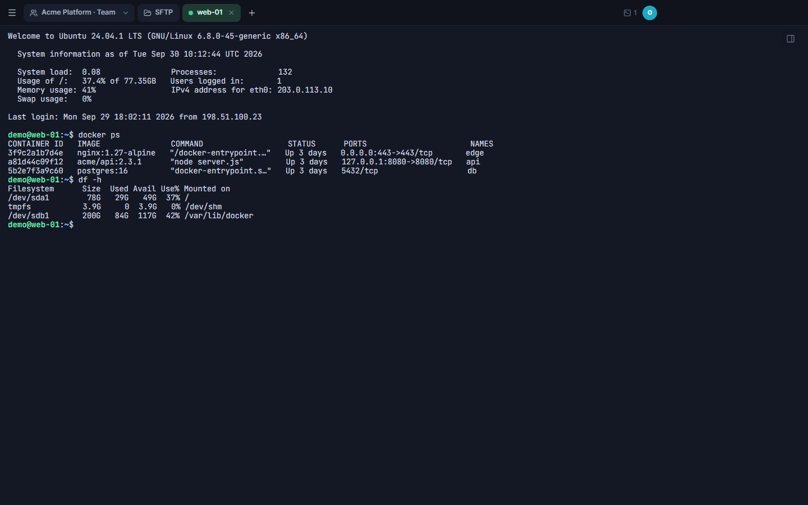
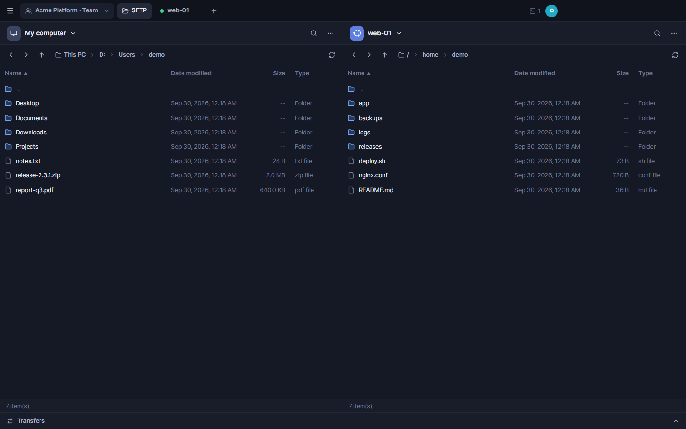
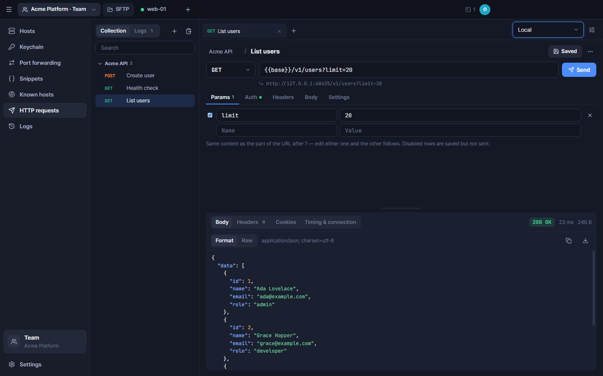

# Terminas

**Terminas is a team SSH manager with end-to-end encryption.** Your team keeps hosts, SSH keys, credentials, snippets and port-forwarding rules in shared vaults, and opens terminals, SFTP and port forwards from one place — in the spirit of Termius, but self-hostable and open source.

Vault contents are encrypted on your device before they reach the server, so the Terminas server (and whoever runs it) stores only ciphertext. The **Windows desktop app** connects to your servers directly from your PC. The **web UI** runs SSH inside the browser, and the Terminas server only relays bytes that are already SSH-encrypted. Server, web UI and desktop app live in this one repository.

[한국어 README](README.ko.md)

## Screenshots

| Hosts | Terminal |
|---|---|
|  |  |
| **SFTP** | **HTTP requests** |
|  |  |

Screenshots use example data.

## Architecture

```
Desktop app (Electron, UI bundled in the app) ─────────── SSH, direct ───────────▶ your servers
Web browser (SSH runs inside the browser)  ──wss──▶  Terminas server /api/relay ──TCP──▶ your servers
                                                     (moves bytes that are already SSH-encrypted)

Terminas server (server/: Node.js · Fastify · SQLite)
   sign-in, teams, permissions and encrypted vault data only —
   it cannot decrypt passwords, keys or host addresses
   + admin console on its own port (127.0.0.1:5282), reachable only from the server machine
```

Both clients talk to the Terminas server over HTTPS for sign-in and for syncing encrypted vault data. The desktop app never loads its UI from the server.

## Features

| | Web | Desktop app (Windows) |
|---|:---:|:---:|
| Teams, invites, per-vault permissions, vault key sharing | ✓ | ✓ |
| Hosts, groups, identities, snippets, port-forwarding rules, known hosts, logs, tag autocomplete | ✓ | ✓ |
| Import SSH keys | ✓ | ✓ |
| Generate SSH keys | Ed25519 | Ed25519, ECDSA, RSA |
| SSH terminal tabs, Ctrl+K host search, host key verification | ✓ (SSH in the browser, via the relay) | ✓ (direct from your PC) |
| Server OS logos (detected on connect) | ✓ | ✓ |
| SFTP: server ↔ server, edit, permissions, drag-and-drop upload, download | ✓ (folder download in Chrome/Edge) | ✓ (+ local computer pane) |
| Sign-in with Google or ID/password, two-factor authentication (TOTP) | ✓ | ✓ |
| Local terminal (PowerShell, cmd, Git Bash, WSL) | | ✓ |
| Port forwarding (local port → host → target) | | ✓ |
| HTTP requests (Postman-style: collections, request tabs, query params table, Bearer/Basic/API key auth, environment variables, history, copy as curl/PowerShell/fetch/Python) | | ✓ |
| Offline mode: vaults open without the server (personal vault editable, team vaults read-only for 7 days after the last sync), personal sync on/off | | ✓ |

The desktop app connects to your servers directly, so each PC must be able to reach them (for servers on a private network, that PC needs a VPN or similar). The web UI only needs the Terminas server to reach them.

Server management (people, teams, server log) is not part of the web UI or the desktop app. It happens in a separate **admin console** that the server opens on its own port, reachable only from the server machine itself (or through an SSH tunnel) — see [docs/self-hosting.md](docs/self-hosting.md#admin-console).

Server OS logos come from [Simple Icons](https://simpleicons.org/) (CC0). Each logo is a trademark of its owner and is used only to show which OS a host runs.

## Security model in short

- **End-to-end encrypted vaults.** Each person sets an *encryption password* that never leaves their device. It unlocks their account key (argon2id), which unlocks their X25519 key pair, which unlocks the vault keys shared with them. Every vault item is encrypted with AES-256-GCM. The server stores ciphertext plus the metadata it needs to enforce permissions.
- **Sign-in is separate from encryption.** Google or ID/password sign-in (optionally with TOTP) only proves who you are. A sign-in password must differ from the encryption password, because the server sees the former and must never be able to open vaults.
- **Web SSH through a narrow relay.** The browser does SSH itself. The relay forwards nothing until the target sends an SSH greeting, so it cannot be used to reach databases, web services or the server itself.
- **Hardened desktop app.** The UI ships inside the integrity-checked app bundle instead of being loaded from the server, Electron fuses and blocked debug switches stop code injection, and updates install only if they carry the project's Ed25519 signature.
- **Offline copies stay encrypted.** To keep working when the server is unreachable, the desktop app keeps the vault ciphertext it received, wrapped again with Windows protected storage (DPAPI). Team vaults stay readable offline for 7 days after the last sync; copies are deleted on sign-out, when access ends and when those 7 days run out.
- **Admin console only on the server machine.** The clients contain no admin screens and the public server has no admin API. Account management runs on a separate port bound to `127.0.0.1`, with its own password (and optional TOTP) set from the server's command line.

Read the full design, including known limitations, in [docs/security-model.md](docs/security-model.md).

## Getting the app

1. Download the Windows installer (`Terminas-Setup-x.y.z.exe`) from [GitHub Releases](https://github.com/Studio-Yeonhong/Terminas/releases).
2. Run it. The installer is not Windows code-signed yet, so SmartScreen may warn on first run (**More info → Run anyway**). Updates are verified separately with the project's own signature.
3. The app updates itself: it checks shortly after start and every 4 hours, downloads new versions in the background and offers an **Update to x.y.z** button. Nothing is installed until you click it and confirm. To try features early, turn on **Settings → Account → Get beta versions** (betas may be unstable).

On first start the app asks which server to use: the **official server** (`https://terminas.yeonhong.studio`, preselected) or a **self-hosted server** (enter its domain or IP address). You can switch later with **Change** next to the server name on the sign-in screen, **Help → Change server address…**, or **Settings → Account → Connected server**. Updates always come from GitHub Releases, whichever server you use, and they install only with the project's Ed25519 signature.

## Self-hosting quick start (Docker)

```bash
git clone https://github.com/Studio-Yeonhong/Terminas.git terminas && cd terminas
cp .env.example .env
# Edit .env: SHELL_PUBLIC_URL=https://terminas.example.com and a sign-in method —
#   Google (GOOGLE_CLIENT_ID / GOOGLE_CLIENT_SECRET / SHELL_BOOTSTRAP_ADMINS) or
#   ID/password (SHELL_PASSWORD_LOGIN=1, SHELL_ADMIN_ID, SHELL_ADMIN_PASSWORD)
# Invite-only by default; SHELL_OPEN_SIGNUP=1 lets anyone sign up with Google.
docker compose up -d
# Put an HTTPS reverse proxy in front of 127.0.0.1:5280 and let it pass WebSocket upgrades for /api/relay.
# Admin console: set its password, then open http://127.0.0.1:5282/admin on the server
# (from elsewhere: ssh -L 5282:127.0.0.1:5282 user@server). Never publish port 5282.
docker compose exec terminas node server/scripts/console-password.ts
```

Requirements, all settings, reverse proxy examples, backups, upgrades and troubleshooting: [docs/self-hosting.md](docs/self-hosting.md).

## Development quick start

```bash
npm install
cp .env.example .env     # set TEST_SSHD_PASSWORD, SHELL_BOOTSTRAP_ADMINS=<your email>, SHELL_DEV_LOGIN=1
npm run dev              # API :5381 + web UI :5380 + a fake SSH server on 127.0.0.1:2222
```

Open http://localhost:5380 and use **Dev sign-in** with the email from `SHELL_BOOTSTRAP_ADMINS`. Repository layout, checks, i18n rules and the release process are in [docs/development.md](docs/development.md).

## Languages

The UI is available in Korean, English, Japanese, Simplified Chinese, Spanish and German. Pick a language on the sign-in screen or at the top of Settings; the first choice follows your browser or OS language. Korean is the source language. Server log and command-line messages are currently in Korean.

## Not yet supported

- Port forwarding in the web UI (browsers cannot open local ports); generating RSA or ECDSA keys in the web UI (importing them works)
- Jump hosts (host chaining), session recording, split view and broadcast input, serial connections
- Remote (`-R`) and dynamic SOCKS (`-D`) forwarding — only local (`-L`) forwarding for now
- Vault key rotation (re-encrypting a vault with a new key after someone leaves), moving hosts between vaults
- HTTP tool: multipart file upload, cookie jar, proxy, pre-request and test scripts, history kept across restarts, WebSocket and gRPC
- Desktop builds for macOS and Linux (only Windows is built and tested)

## Documentation and project files

- [docs/self-hosting.md](docs/self-hosting.md) — run your own Terminas server
- [docs/security-model.md](docs/security-model.md) — encryption design and known limitations
- [docs/development.md](docs/development.md) — working on the code, checks, releases
- [SECURITY.md](SECURITY.md) — reporting vulnerabilities privately
- [CONTRIBUTING.md](CONTRIBUTING.md) — how to contribute
- [README.ko.md](README.ko.md) — Korean README

## License

Copyright (C) 2026 Studio Yeonhong.

Terminas is free software under the **GNU Affero General Public License v3.0 only** (SPDX: `AGPL-3.0-only`). See [LICENSE](LICENSE) for the full text.

In plain words: you may use, study, change and share Terminas, and changed versions stay under the same license. If you distribute it, you must provide its source code. If you **run a modified version as a network service**, you must offer the users of that service its corresponding source code. Every Terminas server shows a **Source code (AGPL-3.0)** link on the sign-in screen and in **Settings → Account**. It points to `SHELL_SOURCE_URL`, which defaults to the official repository (https://github.com/Studio-Yeonhong/Terminas). If you modify the server, set it to where your modified source can be downloaded (see [docs/self-hosting.md](docs/self-hosting.md#sign-up-and-public-links)).
